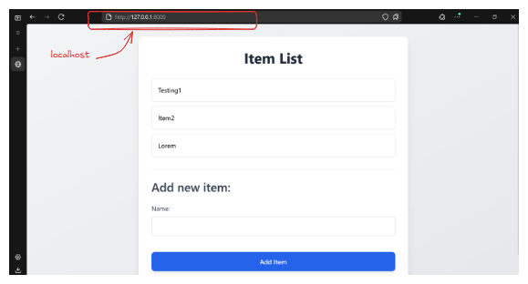
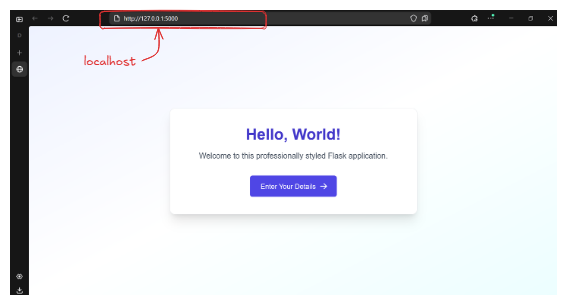

<div align="center">
     <h1>Flask and Django Dockerized Application</h1>
</div>

<div align="center">
  
  
  
  

</div>

## Table of Contents
1. [Introduction](#introduction)
2. [Screenshots](#screenshots)
3. [Project Structure](#project-structure)
4. [Flask app](#flask-application-port-5000)
5. [Django app](#django-application-port-8000)
6. [Running docker compose](#running-the-applications-with-docker-compose)
7. [Jenkins Pipeline](#jenkins-pipeline)

## Introduction

Name: Annalhq Shaikh
Roll No: 13

Containerized both Flask and Django apps using Docker Compose 

Docker images:
1. [Flask app image](https://hub.docker.com/r/annalhq/compose-flask/)
2. [Django app image](https://hub.docker.com/r/annalhq/compose-django)

## Screenshots

<div>
<h4>Flask app</h4>
<div align="center">
     
     <p>Flask Homepage</p>
</div>

<div align="center">
     
     <p>Form</p>
</div>

<div align="center">
     
     <p>Greeting page</p>
</div>

<h4>Django app</h4>
<div align="center">
     
     <p>Django app with database</p>
</div>

<h4>Apps running from docker containers</h4>
<div align="center">
     
     <p>Django app running from docker container</p>
</div>
<div align="center">
     
     <p>Flask app running from docker container</p>
</div>
</div>


## Project Structure

<details>
<summary>Click here to view project structure</summary>

```
.
├── docker-compose.yml
├── flask/
│   ├── app.py
│   ├── requirements.txt
│   ├── Dockerfile
│   └── templates/
│       ├── base.html
│       ├── index.html
│       ├── greet_form.html
│       └── greet_result.html
├── django/
│   ├── manage.py
│   ├── requirements.txt
│   ├── Dockerfile
│   ├── myapp/             # Django project directory
│   │   ├── __init__.py
│   │   ├── settings.py
│   │   ├── urls.py
│   │   ├── wsgi.py
│   │   └── asgi.py
│   └── items/             # Django app directory
│       ├── __init__.py
│       ├── admin.py
│       ├── apps.py
│       ├── forms.py
│       ├── models.py
│       ├── tests.py
│       ├── views.py
│       ├── migrations/
│       └── templates/
│           └── home.html
└── README.md
```

</details>

## Flask Application (Port 5000)

A simple Flask application with the following features:

*   **Homepage (`/`)**: Displays a "Hello, World!" welcome message.
*   **Greeting Form (`/greet`)**:
    *   Presents a form to input a name and age.
    *   Accepts POST requests with the form data.
    *   Performs basic validation (checks if name is provided and age is numeric).
    *   Displays a greeting message (`Hello, [Name]! You are [Age] years old.`) upon successful submission.
    *   Shows an error message on the form if validation fails.

## Django Application (Port 8000)

A basic Django application for managing a list of items:

*   **Homepage (`/`)**:
    *   Displays a list of items retrieved from a SQLite database.
    *   Includes a form to add new items to the list.
*   **Admin Panel (`/admin/`)**:
    *   Provides the standard Django admin interface.
    *   Allows authenticated users (superuser) to Create, Read, Update, and Delete (CRUD) items. (Note: You'll need to create a superuser first).

## Running the Applications with Docker Compose

1.  **Prerequisites**: Make sure you have Docker and Docker Compose installed on your system.
2.  **Build and Run**: Navigate to the root directory containing the `docker-compose.yml` file and run:
    ```bash
    docker-compose up --build
    ```
    This command will build the Docker images for both the Flask and Django applications (if they don't exist) and start the containers.
3.  **Accessing the Apps**:
    *   **Flask App**: Open web browser and go to `http://localhost:5000`
    *   **Django App**: Open web browser and go to `http://localhost:8000`
4.  **Django Admin**:
    *   To access the Django admin panel at `http://localhost:8000/admin/`, we first need to create a superuser. Open another terminal, navigate to the project root, and run:
        ```bash
        docker-compose exec django-app python manage.py createsuperuser
        ```
    *   Follow the prompts to create your admin user.
    *   Now we can log in to the admin panel using the credentials you just created.
5.  **Stopping the Applications**: Press `Ctrl + C` in the terminal where `docker-compose up` is running. To remove the containers, run:
    ```bash
    docker-compose down
    ```
## Jenkins Pipeline

Key Features: 

1. Environment Variables: Defines Docker registry and image names
2. Parameters: Allows selecting deployment environment and toggling tests and image pushing
3. Parallel Execution: Runs lint and test stages in parallel for both applications
4. Conditional Execution: Only runs tests and pushes images when specified
5. Security: Uses Jenkins credentials for Docker registry authentication
6. Environment-specific Deployment: Creates environment-specific overrides for docker-compose
7. Production Safeguard: Requires manual approval for production deployments
8. Cleanup: Ensures workspace is cleaned after pipeline execution